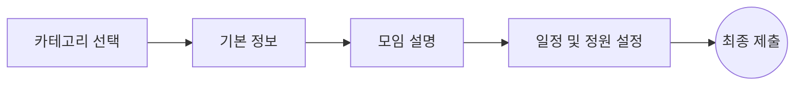

# 🚀 MeetingCreateModal (모임 생성 모달)

`MeetingCreateModal`은 소소잇 서비스에서 사용자가 모임을 생성할 때 사용하는 **4단계 퍼널(Funnel) 기반의 모달 컴포넌트**입니다. 복잡한 입력 과정을 나누어 UI/UX 피로도를 낮추고 단계별 유효성 검사를 통해 데이터 정합성을 보장합니다.

---

## 📅 주요 기능 (Features)

- **4단계 퍼널 시스템**:
  1.  **카테고리 선택**: `함께먹기`, `공동구매` 중 하나를 선택.
  2.  **기본 정보**: 모임 제목, 지역 및 상세 주소(또는 공유 장소) 입력.
  3.  **상세 설명**: 대표 이미지 업로드 및 상세 내용 작성.
  4.  **일정/정원**: 모임 날짜, 시간, 모집 마감 시간, 정원(2~100명) 설정.
- **단계별 유효성 검사**: `react-hook-form`과 `zod`를 결합하여 현재 단계가 유효할 때만 '다음' 버튼이 활성화됩니다.
- **커스텀 폼 컨트롤**: `DatePicker`, `TimeInput` 등 전용 UI 컴포넌트와 연동.
- **반응형 디자인**: 모바일(`343px`)과 데스크톱(`544px`) 환경에 최적화된 레이아웃 및 둥근 모서리(`rounded-[40px]`) 적용.

---

## 📂 폴더 구조 (Folder Structure)

```text
meeting-create-modal/
├── _components/            # 각 단계별 UI 컴포넌트 (Step1~4)
├── hooks/                  # use-meeting-form (비즈니스 로직 및 퍼널 상태 관리)
├── README.md               # 컴포넌트 문서 (본 문서)
├── index.ts                # 외부 노출을 위한 엔트리
├── meeting-create-modal.tsx      # 메인 모달 컴포넌트
├── meeting-create-modal.constants.ts # 상수 관리 (단계 제목, 기본값 등)
├── meeting-create-modal.schema.ts    # Zod 유효성 검사 스키마
├── meeting-create-modal.stories.tsx  # 스토리북 문서화
├── meeting-create-modal.test.tsx    # 단위/통합 테스트
└── meeting-create-modal.types.ts   # 타입 정의
```

---

## 🛠️ 사용 방법 (Usage)

`useModal` 훅을 사용하여 모달의 열림 상태를 관리하며, `onSubmit` 핸들러를 통해 최종 데이터를 전달받습니다.

```tsx
import { MeetingCreateModal } from '@/features/meeting-create/ui/meeting-create-modal';
import { useModal } from '@/hooks/use-modal';

export default function Page() {
  const { isOpen, open, close } = useModal();

  const handleCreateMeeting = async (data: MeetingFormData) => {
    // API 호출 로직
    console.log('생성 데이터:', data);
  };

  return (
    <>
      <button onClick={open}>모임 만들기</button>
      <MeetingCreateModal open={isOpen} onClose={close} onSubmit={handleCreateMeeting} />
    </>
  );
}
```

---

## 🔄 퍼널 흐름 (Funnel Flow)



---

## 💡 기술적 특징

### 1. 전역 상태 배제 (Local State Focus)

컴포넌트 내의 복잡한 폼 상태는 `react-hook-form`으로 로컬 관리하며, `useMeetingForm` 커스텀 훅을 통해 폼 로직과 퍼널 이동 로직을 캡슐화했습니다.

### 2. React Compiler 최적화

프로젝트 규칙에 따라 `useMemo`, `useCallback` 등을 수동으로 사용하지 않고, React Compiler가 자동으로 성능을 최적화할 수 있도록 순수 함수와 깔끔한 컴포넌트 구조를 유지합니다.

### 3. 유동적인 레이아웃

- 모바일: `w-[343px]`, `rounded-[24px]`, 패딩 `p-6`
- 데스크톱: `w-[544px]`, `rounded-[40px]`, 패딩 `p-12`

---

## 🧪 테스트 (Testing)

`npm run test` 명령어를 통해 `meeting-create-modal.test.tsx`를 실행하여 각 단계의 이동 로직과 유효성 검사 규칙을 자동으로 검증할 수 있습니다.
